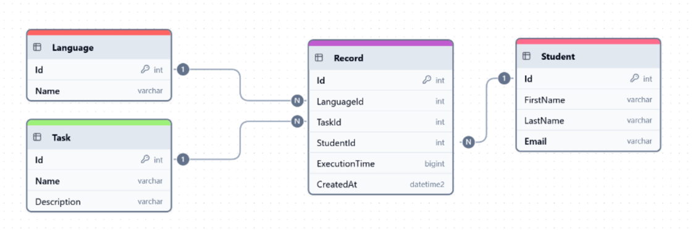

# 🎓 RecordMania – Student Record API

RecordMania is a simple academic API developed for university testing purposes. It simulates a programming competition system where students submit task results and compete for optimization and performance.

> “Instead of writing boring boilerplate code over and over, let’s make it fun – like a sport.” – The Rector

---

## 🛠️ Getting Started

### Clone the Repository

```bash
git clone https://github.com/antonio-backnotfront/student-records-api
cd recordmania
```

## 🤖 Configuration
Create an appsettings.json file in the project root with the following structure: 
```json
{
  "Logging": {
    "LogLevel": {
      "Default": "Information",
      "Microsoft.AspNetCore": "Warning"
    }
  },
  "ConnectionStrings": {
    "DefaultDatabase": "Server=your_server;Database=your_db;User=placeholder;Password=placeholder;"
  }
}
```

 ## 📊 Database Schema

A preview of the EF Core Code-First schema used in the project:


## 📱 Functional Requirements

```http request
GET /api/records
```
- Returns a list of all records
- Supports filtering by:
  - Creation date
  - Programming language ID
  - Task ID
- Sorted by:
  - CreatedAt (newest first)
  - Student.LastName (ascending)
---
```http request
POST /api/records
```
- Adds a new student record
- Returns appropriate HTTP error codes if:
  - Student or language does not exist
  - Task doesn't exist (but task name + description is provided → create it)

## 📌 Tech Stack

- ASP.NET Core
- Entity Framework Core (Code-First)
- SQL Server
